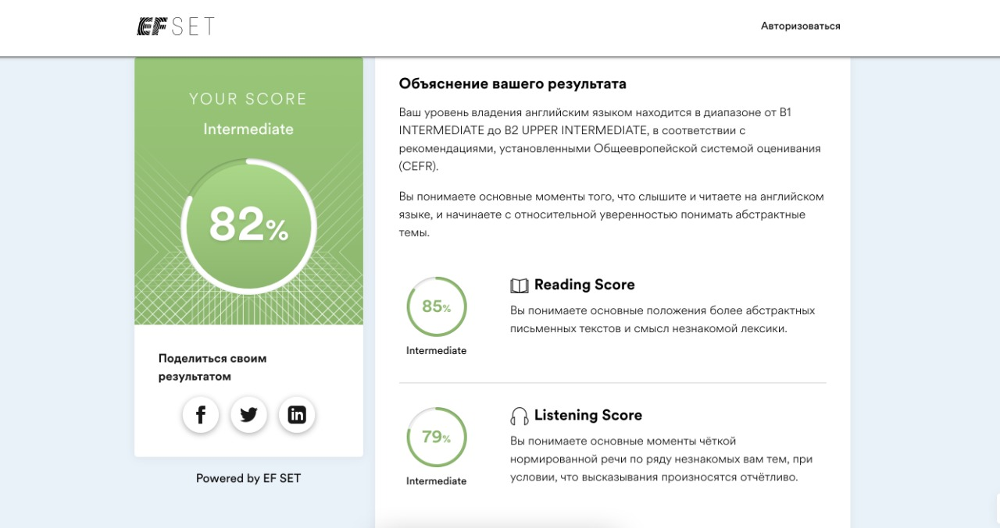

# Nataliia Maksymiv

### Junior Frontend Developer

## Contact Information:

**Location**: Kyiv, Ukraine

**Phone**: +380994112465

**Mail**: <nataliya.maksymiv2017@gmail.com>

**Github**: [dragonfly2201](https://github.com/dragonfly2201)

**LinkedIn**: [natali-m](https://www.linkedin.com/in/natali-m-10a129222/)

## Career Objective:

**A highly motivated hardworking person. I am very attentive to detailes, a quick learner. I want to create a digital magic and elevate user experience to the next level**

## Work Experience:

## Knowledge:

- HTML5/CSS3
- JavaScript(Basic)
- Git/Github(basic)
- Figma
- Adobe Photoshop
- 3D Maya
- Blender

## Code Example:

    function sum(a, b) {
        return a + b;
    }

    let result = sum(1, 2);
    alert( result );    

## Education:

- RS Schools Course «JavaScript/Front-end. Stage 0»[rs.school](https://rs.school/) (in progress)
- JavaScript Manual on [learn.javascript.ru](https://learn.javascript.ru/)(in progress)
- HTML and CSS Tutorials on [ru.code-basics.com](https://ru.code-basics.com/)(in progress)
- English in London School of English [lse.ua](https://lse.ua/)
- Ivano-Frankivsk National Technical University of Oil and Gas
[nung.edu.ua](https://nung.edu.ua/)

## Languages:

- English-Intermadiate (*according to the online test on*[efset.org](https://www.efset.org/) )

- Hebrow-Fluent
- Polish-Basic
- Russian/Ukrainian-Native
